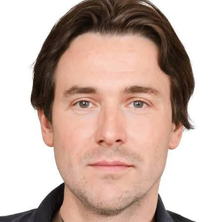
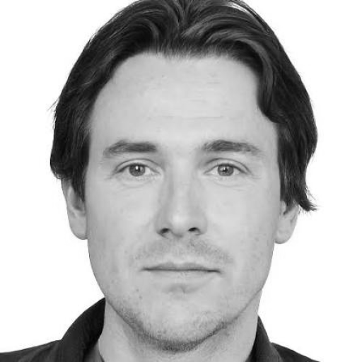
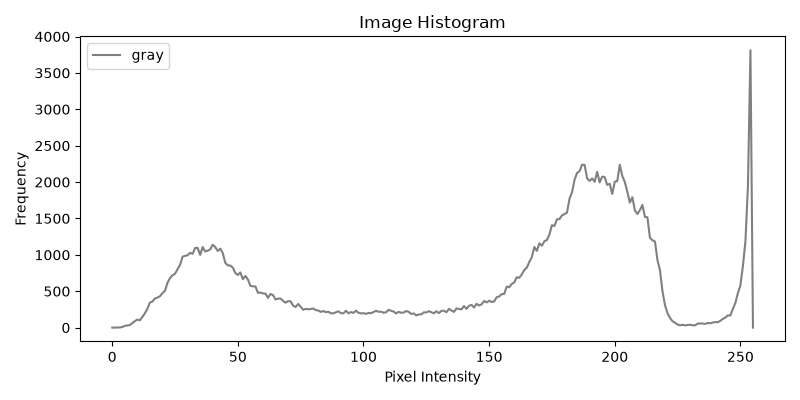
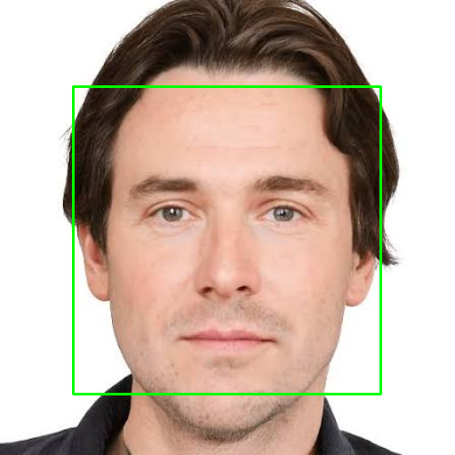
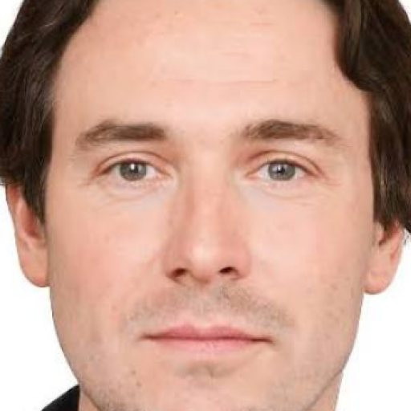
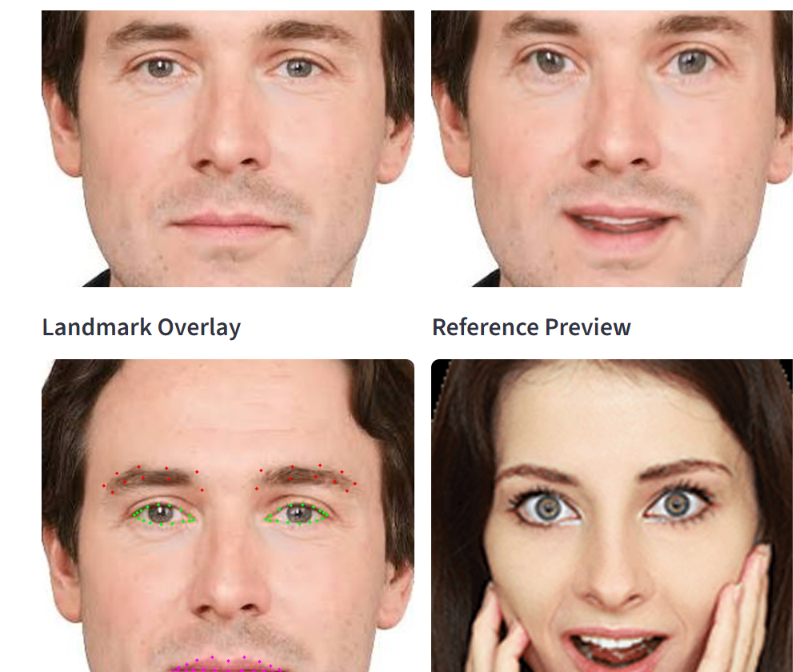

# Facial Image Warping

Bu repo, **Facial Image Warping, Aging, and Expression Transformation** projesinin ilk on sprintinin calisan temelini icerir. Su ana kadar odak noktasi, yuzu degistirmekten once veriyi **dogru almak**, **DSP acisindan standardize etmek**, **yuz bolgesini ayirmak**, **yuzu landmark noktalariyla temsil etmek**, **geometric warping** uygulamak ve son olarak **frekans alaninda analiz etmek** oldu.

Mevcut durumda tamamlanan katmanlar:

1. `Sprint 1` - Image input ve preprocessing
2. `Sprint 2` - Face detection ve face crop
3. `Sprint 3` - Facial landmark detection ve landmark export
4. `Sprint 4` - Geometric facial image warping
5. `Sprint 5` - Frequency domain DSP analysis
6. `Sprint 6` - Aging and de-aging simulation
7. `Sprint 7` - Quantitative evaluation module
8. `Sprint 8` - Streamlit GUI
9. `Sprint 9` - Real-time webcam integration
10. `Sprint 10` - Advanced AI-based expression transfer

Henuz tamamlanmayan katmanlar:

- GAN/diffusion tabanli generative expression transfer
- Full production-grade browser webcam streaming

## DSP Mantigi

Bu projede goruntu, klasik bir fotograf dosyasi gibi degil, **2 boyutlu sayisal sinyal** olarak ele alinir. Kurulan akis su mantiga dayanir:

`User Input -> Image Acquisition -> Preprocessing -> ROI Extraction -> Landmark Representation -> Geometric Warping -> Frequency Analysis -> Future DSP Stages`

Bu zincirde su ana kadar yapilan isler:

- **Image acquisition**: giris dosyasini dogrulama ve bellege alma
- **Preprocessing**: renk uzayi donusumu, grayscale, resize, normalize etme
- **ROI extraction**: tum goruntu yerine yalnizca yuz bolgesini secme
- **Geometric representation**: yuzu landmark ile parametrik olarak ifade etme
- **Triangle warping**: landmark displacement ile affine triangle deformasyonu
- **Frequency analysis**: uzamsal alandan frekans alanina gecip spektral enerji olcme
- **Quantitative evaluation**: donusum farkini MSE, PSNR ve SSIM ile olcme
- **Interactive UI**: ayni pipelinei Streamlit arayuzu uzerinden parametre kontrollu calistirma

Bu sayede aging, de-aging, kalite analizi, webcam denemeleri ve referans ifadeye dayali transfer islemleri dogrudan ham goruntuye degil, temizlenmis ve anlamli hale getirilmis yuz verisine uygulanir.

## Su Ana Kadarki Mimari

### Ana moduller

1. `input_module.py`
   Giris dosyasini dogrular, goruntuyu yukler, metadata uretir.
2. `preprocessing.py`
   `BGR/RGB/grayscale`, resize, normalization, histogram ve processed image uretir.
3. `face_detection.py`
   OpenCV Haar Cascade ile yuz bulur, bounding box cizer, yuz crop alir.
4. `landmark_detection.py`
   MediaPipe Face Mesh ile landmark cikarir, JSON/CSV export yapar.
5. `geometric_warping.py`
   Target landmark uretir, Delaunay triangulation kurar, triangle affine warp uygular.
6. `fourier_analysis.py`
   FFT, magnitude spectrum, spektral enerji ve CSV export uretir.
7. `evaluation.py`
   MSE, PSNR, SSIM, difference visualization ve CSV export uretir.
8. `visualization.py`
   Pipeline sonuc ozetlerini ve UI destek verilerini toplar.
9. `app.py`
   Sprint bazli pipeline giris noktalarini saglar.
10. `streamlit_app.py`
   Upload, webcam capture, transfer, method comparison, spectrum ve metric tablo arayuzunu saglar.
11. `expression_transfer.py`
   Referans yuzden ifade geometrisini source yuze aktarir; `safe_classical`, `tps` ve `expression_coefficients` methodlarini icerir.
12. `webcam_demo.py`
   OpenCV tabanli gercek zamanli webcam donusum demosunu calistirir.
13. `desktop_gui.py`
   Tkinter tabanli masaustu arayuzdur; `Image Studio` ve `Real-Time Lab` akislarini browser olmadan local OpenCV ile calistirir.

### Pipeline giris noktalari

- `run_preprocessing_pipeline(...)`
- `run_face_detection_pipeline(...)`
- `run_landmark_pipeline(...)`
- `run_expression_warp_pipeline(...)`
- `run_frequency_analysis_pipeline(...)`
- `run_aging_pipeline(...)`
- `run_deaging_pipeline(...)`
- `run_analysis_pipeline(...)`
- `run_reference_expression_transfer_pipeline(...)`

## Ornek Akis

Asagidaki ornek, `samples/test_face_1.jpg` uzerinden sistemin su ana kadar neleri urettigini gosterir.

### 1. Ornek giris yuzu

Bu gorsel sistemin aldigi ham inputtur. Bu asamada henuz sinyal secimi yoktur; arka plan ve yuz birlikte islenir.



### 2. Preprocessed face

Bu cikti preprocessing adimindan gelir:

- goruntu okunur
- standart cozunurluge tasinir
- normalize edilir
- sonraki asamalarin tutarli calismasi icin standardize edilir

Bu adimin DSP karsiligi, giris sinyalini ortak bir olcege cekmek ve sonraki islemlere uygun hale getirmektir.



### 3. Histogram ciktisi

Histogram, goruntu yogunluk dagilimini gosterir. Bu, sinyalin enerji dagilimi kadar guclu bir analiz degildir ama preprocessing asamasinda parlaklik ve kontrast karakterini anlamak icin temel bir aractir.



### 4. Detected face

Bu asamada OpenCV Haar Cascade ile yuz bulunur ve bounding box cizilir.

Burada yapilan is:

- nesne tespiti
- koordinat uretimi
- ROI secimi icin yuz sinirini tanimlama

DSP acisindan bu adim, butun sinyalden sadece anlamli alt bolgeyi ayirmaya giden ilk adimdir.



### 5. Face crop

Bounding box kullanilarak yuz bolgesi kesilir ve ayri bir goruntu olarak normalize edilir.

Bu adim cok kritiktir cunku sonraki landmark, warping ve aging islemleri tum fotograf uzerinde degil, yalnizca bu ROI uzerinde yapilacaktir.



### 6. Landmark ciktisi

Sprint 3 ile MediaPipe Face Mesh uzerinden landmark uretimi eklenmistir. Calisan akis sonunda su dosyalar uretilir:

- `outputs/landmarks/<name>_landmarks.png`
- `outputs/landmarks/<name>_landmarks.json`
- `outputs/landmarks/<name>_landmarks.csv`

Asagidaki ornek gorsel, `test_face_1.jpg` icin uretilen gercek landmark overlay ciktisidir:


Bu asama, geometric warping icin kritik veri uretir. Sonraki sprintlerde agiz, kas, goz, cene ve yanak deformasyonlari dogrudan bu landmark koordinatlari uzerinden yapilacaktir.

### 7. Geometric warping ciktisi

Sprint 4 ile landmark displacement tabanli geometric warping eklendi. Burada sistem:

- source landmarklari alir
- expression tipine gore target landmark uretir
- Delaunay triangulation kurar
- her triangle icin affine transform uygular
- triangle sonuclarini bosluk ve discontinuity olusturmadan birlestirir

Bu asama su kavramlari ogretir:

- affine transform
- triangle warping
- interpolation
- coordinate mapping
- mesh-based deformation

### 8. Frequency domain analysis

Sprint 5 ile goruntu uzamsal alandan frekans alanina tasinir. Burada:

- grayscale goruntu uzerinde `2D FFT` hesaplanir
- sifir frekans bileseni merkeze kaydirilir
- `log magnitude spectrum` elde edilir
- toplam, dusuk ve yuksek frekans enerjileri hesaplanir
- `high / low frequency ratio` bulunur
- sonuclar CSV olarak disa aktarilir

Bu asama su kavramlari ogretir:

- spatial domain
- frequency domain
- magnitude spectrum
- low / high frequency separation
- spectral energy analysis

## Landmark Koordinatlarinin Mantigi

MediaPipe, landmark noktalarini once **normalize koordinat** olarak verir:

- `x` degeri genislige gore `0-1`
- `y` degeri yukseklige gore `0-1`

Bu yaklasimin avantaji:

- farkli cozunurluklerde ayni yuz geometrisini tasimak kolaylasir
- model ekran pikseline degil goreli konuma konusur

Ama OpenCV cizimi ve crop islemleri icin bu koordinatlar piksele cevrilmelidir. Bu yuzden `landmark_detection.py` icinde normalize degerler mutlak piksele donusturulur.

## Su Ana Kadar Hangi Gereksinimler Tamamlandi

### Sprint 1

- JPG ve PNG yukleme
- dosya uzantisi ve varlik dogrulama
- `BGR -> RGB -> GRAYSCALE` donusumleri
- standart cozunurlukte resize
- piksel normalizasyonu
- histogram olusturma
- processed image kaydetme

### Sprint 2

- frontal face detection
- bounding box cizme
- detected face preview kaydetme
- crop alma
- crop'u normalize etme
- yuz bulunamazsa acik hata verme

### Sprint 3

- MediaPipe ile face mesh cikarma
- full landmark visualization
- region-based visualization
- JSON export
- CSV export
- landmark visualization toggle

### Sprint 4

- target landmark creation
- smile enhancement
- eyebrow raising
- lip widening
- face slimming
- Delaunay triangulation
- triangle-based affine warp
- before-after comparison kaydetme
- intensity kontrollu deformasyon

### Sprint 5

- grayscale frequency analysis
- 2D FFT
- FFT shift
- log magnitude spectrum
- side-by-side spectrum visualization
- total spectral energy
- low-frequency energy
- high-frequency energy
- high / low energy ratio
- CSV export

### Sprint 6

- high-frequency texture enhancement
- wrinkle-like detail simulation
- local contrast boost
- edge-preserving aging filter
- low-pass smoothing for de-aging
- bilateral filtering for skin softening
- adjustable intensity parameter
- outputs/aging/ icine kaydetme
- uygulanan filtreleri metinsel olarak donme

### Sprint 7

- MSE hesaplama
- PSNR hesaplama
- SSIM hesaplama
- image difference visualization
- evaluation metric CSV export
- original-transformed quantitative comparison

### Sprint 8

- Streamlit GUI
- image upload
- transformation selection
- intensity slider
- landmark toggle
- before-after display
- Fourier spectrum before-after display
- metric table
- CSV download

### Sprint 9

- OpenCV webcam capture
- real-time face crop preview
- real-time aging/de-aging and warping demo
- reference expression transfer in webcam mode
- keyboard-controlled demo exit

### Sprint 10

- reference image based expression transfer
- aligned ve region-aware expression transfer
- `safe_classical`, `tps` ve `expression_coefficients` transfer methodlari
- method-level metric comparison ve `Auto Compare All` secenegi
- expression match, identity preservation ve transfer quality score hesaplari
- mouth-interior / teeth-aware local patch blend
- source-reference landmark visualization
- transfer region selection
- transfer explanation output

## Reference Expression Transfer

Bu proje artik tek bir expression-transfer mantigina bagli degildir. `Reference Expression Transfer` akisinda ayni source/reference ciftine uc farkli muhendislik yaklasimi uygulanabilir:

- `safe_classical`
- `tps`
- `expression_coefficients`

GUI tarafinda bunlara ek olarak `Auto Compare All` secenegi vardir. Bu secenek tum methodlari ayni girdide calistirir, her biri icin skor uretir ve en yuksek `transfer_quality_score` degerini alan sonucu onerir.

Asagidaki gorsel, GUI icinde source, transformed, landmark overlay ve reference preview yerlesimini gosterir:



### Neden tek method yetmiyor?

Expression transfer problemi yalnizca "landmark noktasini baska yere tasimak" degildir. Asil problem:

- source yuzun kimligini korumak
- reference yuzun ifadesini almak
- goz, kas, dudak ve agiz ici gibi bolgelerde bunu artefactsiz yapmak

Bu yuzden sistem tek bir warp yerine method-secilebilir bir yapiya gecirilmistir.

### 1. Safe Classical

`safe_classical`, klasik landmark-displacement + Delaunay triangle warp hattinin daha guvenli bir surumudur.

Calisma mantigi:

- source ve reference landmarklari once similarity transform ile ayni koordinat sistemine hizalanir
- sadece secilen regionlar (`eyes`, `eyebrows`, `lips`) hedef displacement uretiminde kullanilir
- displacement buyuklugu clamp edilir; boylece agiz kosesi veya kas gibi noktalar asiri ziplamaz
- warp triangle tabanli ilerler
- son cikti source ve target region union maskesi ile feathered blend edilir

Avantajlari:

- en kolay debug edilen yoldur
- lokal geometri degisimi kontrolludur
- zayif landmark durumlarinda digerlerine gore daha kararlidir

Sinirlari:

- triangle tabanli warp oldugu icin mesh izleri ve lokal kirilmalar daha kolay gorulur
- kimlik ve ifade ayrimi zayiftir

### 2. Thin Plate Spline

`tps`, ayni regional hedefleri daha yumusak bir uzaysal deformasyonla tasir.

Calisma mantigi:

- secilen expression region landmarklari TPS control point olarak kurulur
- buna ek olarak stabil anchor noktalar ve frame anchor noktalar eklenir
- inverse TPS remap ile source piksel koordinatlari target geometriye cekilir
- cikis, source ve target bolgelerinin union maskesi ile blend edilir

Avantajlari:

- triangle sinirlari olmadigi icin deformasyon daha akiskan gorunur
- kas, goz kapagi ve dudak cevresinde daha dogal geometri verir

Sinirlari:

- halen geometri-temelli oldugu icin source izi ve ghosting tamamen yok olmaz
- acik agiz, dis, iris gibi texture gerektiren bolgelerde tek basina yeterli degildir

### 3. Expression Coefficients

`expression_coefficients`, bu repo icindeki en guclu ve en modernlesmis yaklasimdir. Bu method dogrudan "referansin yuz seklini" degil, "referansin ifade parametrelerini" tasimaya calisir.

Cikartilan parametreler:

- `left_eye_open`
- `right_eye_open`
- `mouth_width`
- `mouth_open`
- `brow_raise_left`
- `brow_raise_right`
- `mouth_corner_left`
- `mouth_corner_right`

Calisma mantigi:

- source ve reference landmarklarindan normalize ifade katsayilari hesaplanir
- bu katsayilar arasi fark, source landmarklari uzerinde kontrollu bir hedef geometriye donusturulur
- ardindan TPS benzeri yumusak warp ve bolgesel blend uygulanir
- referansta acik agiz varsa `inner mouth` bolgesi icin ayri bir patch transferi calisir
- bu patch, dis gorunurlugu ve mouth cavity bilgisini transformed yuze tasimaya yardim eder

Avantajlari:

- kimlik koruma acisindan en guclu yoldur
- goz ve dudakta daha az "tam referans yuzu yapistirma" hissi verir
- Auto Compare icinde genelde en yuksek skoru almasi beklenen temel method budur

Sinirlari:

- tam 3D reenactment degildir
- goz ici, iris ve tam mouth interior icin halen daha ileri patch / segmentation adimlari gerekir

### Auto Compare All nasil calisir?

`Auto Compare All`, su methodlari ayni source/reference cifti icin calistirir:

- `safe_classical`
- `tps`
- `expression_coefficients`

Her sonuc icin asagidaki metrikler uretilir:

- `MSE`
- `PSNR`
- `SSIM`
- `expression_match_score`
- `identity_preservation_score`
- `transfer_quality_score`

Buradaki mantik:

- `expression_match_score`: transformed ifadenin reference ifadeye ne kadar yaklastigini olcer
- `identity_preservation_score`: transformed yuzun source kimligini ne kadar korudugunu olcer
- `transfer_quality_score`: ifade uyumu ile kimlik korumayi birlikte skorlar

Pratikte:

- en dusuk `MSE` her zaman en iyi transfer degildir
- en yuksek `SSIM` bazen neredeyse hic ifade tasinmamis anlamina gelebilir
- bu yuzden method seciminde ana karar metriği `transfer_quality_score` olarak kullanilir

### Camera capture ve real-time akisinda neler degisti?

Reference transfer sadece statik upload degil, `camera capture` ve `Real-Time Lab` akislarinda da guncellendi.

Eklenen muhendislik iyilestirmeleri:

- face crop preview ile analysis image ayrildi
- landmark inference icin kucuk crop once upscale edilir
- landmark koordinatlari tekrar orijinal crop'a map edilir
- webcam modunda EMA smoothing uygulanir
- region-secili overlay kullanilir; gereksiz full-mesh cizimi azaltilir
- stream quality profilleri ile frame boyutu ve frame-skip kontrol edilir

Bu sayede hem landmark overlay daha okunur hale gelir hem de real-time akis daha az donar.

### Neden Local OpenCV / DroidCam fallback eklendi?

Windows tarafinda browser tabanli `camera_input` ve WebRTC akislarinda su pratik problemler goruldu:

- built-in kamera bazi cihazlarda hic acilmiyor
- bazi laptoplarda kamera sadece `320x240` gibi dusuk bir modda acilip tekrar dusuyor
- browser `SELECT DEVICE` ile secilen sanal/USB kamera her zaman Streamlit tarafina kararlı sekilde ulasmiyor
- sayfa rerun modeli nedeniyle webcam goruntusu GIF benzeri titreme ve gecikme hissi uretebiliyor

Bu nedenle projede ikinci bir yol eklendi:

- `Real-Time Lab -> Live backend = Local OpenCV Device`
- `Image Studio -> Camera capture -> Capture backend = Local OpenCV Device`

Bu yol browser kamera erisimi yerine dogrudan `cv2.VideoCapture(...)` kullanir. Boylece:

- USB kamera veya DroidCam device index ile acilir
- `Image Studio` icinde browser izin popup'ina bagimli olmadan snapshot alinabilir
- `Real-Time Lab` icinde kalici USB stream mantigi uygulanabilir
- built-in kamera yoksa ya da kararsizsa harici kamera ile calismaya devam edilir

Bu fallback, performans problemini tamamen cozulmus saymaz. Mevcut yapi:

- daha dayanikli bir capture zinciri saglar
- browser kaynakli cihaz secme problemlerini azaltir
- ama yine de landmark, transform ve Streamlit render maliyetleri icin ek optimizasyon gerektirir

Kisacasi: built-in kamera yoksa veya guvensiz calisiyorsa sistem su anda `Local OpenCV + DroidCam USB` yolu ile calisacak sekilde duzenlenmistir; sonraki adim performansi daha da artirmaktir.

### Windows'ta hangi kamera index'i kullaniliyor?

Device index makineden makineye degisir; sabit olarak `0` kabul edilmemelidir. Bu projede indeks tarama icin asagidaki komut eklendi:

```bash
python webcam_demo.py --probe-devices
```

Bu komut Windows/OpenCV tarafinda acilabilen kamera index'lerini listeler. Bu makinede test sirasinda:

```text
Available camera indices: 0, 3, 4
```

goruldu. Ardindan ham preview testi ile stabil acilan cihaz:

```bash
python webcam_demo.py --device-index 4 --raw-preview
```

olarak dogrulandi. Bu yuzden README ve GUI icindeki ornek ayarlarda `device index = 4` onerildi.

Onemli not:

- `0` genelde built-in kamera olabilir ama garanti degildir
- `3` veya `4` DroidCam / external virtual camera olabilir
- dogru index her zaman `--probe-devices` ile bulunmalidir

### Streamlit icinde DroidCam / USB capture nasil kullanilir?

`Image Studio` icin:

1. `Source input = Camera capture`
2. `Camera profile = DroidCam USB / External Virtual Camera`
3. `Capture backend = Local OpenCV Device`
4. `Capture device index = 4`
5. once `Preview USB Frame`
6. sonra `Capture From USB`

Bu capture alindiginda kare ayni sayfada preview olarak gosterilir ve pipeline'a source image olarak girer.

`Real-Time Lab` icin:

1. `Live backend = Local OpenCV Device`
2. `Live camera profile = DroidCam USB / External Virtual Camera`
3. `Local device index = 4`
4. `Keep USB stream active = On`

Bu mod browser `SELECT DEVICE` mantigindan bagimsizdir ve USB/DroidCam akisini Streamlit icinde daha kalici tutmak icin eklendi.

### Neden ayrica masaustu GUI eklendi?

Streamlit arayuzu hizli prototipleme icin faydali oldu; ancak bu projede:

- real-time kamera akisi
- landmark detection
- reference expression transfer
- surekli preview guncelleme

bir araya gelince `rerun` tabanli UI modelinin dogal sinirlarina carpmaya baslandi. Bu nedenle projeye ek olarak `Tkinter` tabanli masaustu GUI eklendi.

Masaustu katmanin amaci:

- mevcut backend pipeline'i korumak
- browser / WebRTC / `camera_input` bagimliligini azaltmak
- local OpenCV kamera akisini daha kararlı kullanmak
- `Image Studio` ve `Real-Time Lab` akislarini masaustu pencerede sunmak

Masaustu GUI icindeki guncel ozellikler:

- `Image Studio` sekmesi
- `Real-Time Lab` sekmesi
- source image upload
- local OpenCV camera snapshot preview ve capture
- reference image secimi
- transformation secimi
- transfer method secimi
- region secimi
- intensity slider ve yuzde gosterimi
- `Source Preview` ve `Transformed Preview` icin buyuk ust panel
- `Landmark Overlay`, `Reference Preview`, `Fourier Before`, `Absolute Difference` icin sekmeli alt panel
- scrollable pencere yerlesimi
- metrics paneli
- transformed PNG / metrics CSV / difference PNG export
- local OpenCV live stream
- live frame'i `Image Studio` icine snapshot olarak tasima

Bu yapi Streamlit'i kaldirmiyor; ona ek olarak masaustu kullanim secenegi sunuyor.

### Agiz ici ve dis gorunurlugu neden ayri ele alindi?

Acik agiz referanslarinda yalnizca dudak cizgisini asagi indirmek dogru sonuc vermez. Dis, mouth cavity ve ic dudak dokusu da gorunur olmalidir. Bu repo icindeki guncel transfer mantigi bu problemi kisitli da olsa ele alir:

- `inner mouth` landmark poligonu olusturulur
- referans agiz acikligi source'tan buyukse local mouth patch transfer aktif olur
- referans face image, target canvas boyutuna yeniden olceklenir
- mouth patch TPS ile hedef geometriye cekilir
- yalnizca inner-mouth maskesi icinde alpha blend yapilir

Bu adim, "dudaklar acildi ama iceride dis yok" problemini azaltmak icin eklenmistir.

### Muhendislik yorumu

Bilgisayar muhendisligi acisindan bu uc method farkli soyutlama seviyelerini temsil eder:

- `safe_classical`: mesh tabanli deterministik local warp
- `tps`: daha duzgun diferansiyellenebilir olmayan ama yumusak global deformation field
- `expression_coefficients`: landmarklardan dusuk boyutlu ifade parametre uzayi cikarip onu source geometriye uygulama

Bu nedenle:

- geometri deneyi yapmak icin `safe_classical`
- yumusak deformasyon incelemek icin `tps`
- gercege en yakin, kimlik koruyan transfer icin `expression_coefficients`

onerilen baslangic secimidir.

## Dosya Yapisi

```text
facial-image-warping/
|- app.py
|- pyproject.toml
|- README.md
|- docs/
|  |- images/
|- outputs/
|- samples/
|- src/
|  |- facial_image_warping/
|     |- face_detection.py
|     |- geometric_warping.py
|     |- fourier_analysis.py
|     |- input_module.py
|     |- landmark_detection.py
|     |- preprocessing.py
|     `- ...
`- tests/
```

## Kurulum

Bu proje icin surumler, "en yeni olan" mantigiyla degil, **koddaki API kullanimiyla uyumlu** olacak sekilde secildi.

Ozellikle:

- `opencv-python>=4.10,<5`
- `mediapipe==0.10.9`
- `numpy>=1.26,<2.0`
- `scikit-image>=0.24,<1`
- `streamlit>=1.36,<2`

Kurulum:

```bash
pip install -e ".[dev]"
```

## Calistirma

Terminal prompt su olmali:
`PS C:\facial-image-warping>`

Eger prompt baska yerdeyse, once:

```powershell
cd C:\facial-image-warping
```

### Sprint 1

```bash
python -c "from app import run_preprocessing_pipeline; r = run_preprocessing_pipeline('samples/test_face_1.jpg'); print(r['processed_image_path']); print(r['histogram_path'])"
```

### Sprint 2

```bash
python -c "from app import run_face_detection_pipeline; r = run_face_detection_pipeline('samples/test_face_1.jpg'); print(r['bounding_box']); print(r['cropped_face_path'])"
```

### Sprint 3

```bash
python -c "from app import run_landmark_pipeline; r = run_landmark_pipeline('samples/test_face_1.jpg', show_full_mesh=True, selected_regions=['eyes','nose','lips']); print(r['landmark_count']); print(r['json_path']); print(r['csv_path'])"
```

### Sprint 4

```bash
python -c "from app import run_expression_warp_pipeline; r = run_expression_warp_pipeline('samples/test_face_1.jpg', transformation='smile_enhancement', intensity=0.7); print(r['operation']); print(r['warped_image_path']); print(r['comparison_image_path'])"
```

### Sprint 5

```bash
python -c "from app import run_frequency_analysis_pipeline; r = run_frequency_analysis_pipeline('samples/test_face_1.jpg'); print(r['total_energy']); print(r['high_low_ratio']); print(r['spectrum_path']); print(r['csv_path'])"
```

### Sprint 6

```bash
python -c "from app import run_aging_pipeline; r = run_aging_pipeline('samples/test_face_1.jpg', intensity=0.7); print(r['mode']); print(r['intensity']); print(r['output_path']); print(r['filter_explanation'])"
```

```bash
python -c "from app import run_deaging_pipeline; r = run_deaging_pipeline('samples/test_face_1.jpg', intensity=0.4); print(r['mode']); print(r['intensity']); print(r['output_path']); print(r['filter_explanation'])"
```

### Sprint 7

```bash
python -c "from app import run_analysis_pipeline; r = run_analysis_pipeline('samples/test_face_1.jpg', transformation='smile_enhancement', intensity=0.6, show_landmarks=True); print(r['metrics']['mse']); print(r['metrics']['psnr']); print(r['metrics']['ssim']); print(r['metrics']['csv_path'])"
```

### Sprint 8

```bash
streamlit run streamlit_app.py
```


Modern ayri GUI katmani:

```bash
streamlit run gui/dashboard.py
```

Masaustu GUI:

```bash
python desktop_gui.py
```

Masaustu GUI kullanim akisi:

1. `python desktop_gui.py` ile pencereyi ac
2. `Image Studio` sekmesinde source image sec veya `Capture From Camera` kullan
3. gerekiyorsa reference image sec
4. transformation, intensity ve regions ayarlarini yap
5. `Run Pipeline` ile sonucu uret
6. `Save Transformed PNG`, `Save Metrics CSV`, `Save Difference PNG` ile export al

`Real-Time Lab` icin:

1. `Live Device Index` alanina dogru OpenCV index'ini gir
2. gerekirse ortak reference image sec
3. `Start Live` ile local OpenCV akisini baslat
4. `Analyze Current Frame in Image Studio` ile canli frameden statik analiz al

### Sprint 9

```bash
python webcam_demo.py --transformation aging --intensity 0.6
```

```bash
python webcam_demo.py --transformation reference_expression_transfer --reference-image samples/test_face_2.png --intensity 0.75
```

Windows cihaz index taramasi:

```bash
python webcam_demo.py --probe-devices
```

DroidCam / USB raw preview testi:

```bash
python webcam_demo.py --device-index 4 --raw-preview
```

### Sprint 10

```bash
python -c "from app import run_reference_expression_transfer_pipeline; r = run_reference_expression_transfer_pipeline('samples/test_face_1.jpg', 'samples/test_face_2.png', blend_factor=0.7, show_landmarks=True, selected_regions=['eyes','eyebrows','lips'], transfer_method='expression_coefficients'); print(r['transformation']['operation']); print(r['metrics']['transfer_quality_score']); print(r['metrics']['expression_match_score']); print(r['transformation']['warped_image_path'])"
```

```bash
python -c "from app import compare_reference_expression_transfer_methods; r = compare_reference_expression_transfer_methods('samples/test_face_1.jpg', 'samples/test_face_2.png', blend_factor=0.7, show_landmarks=True, selected_regions=['eyes','eyebrows','lips']); print(r['best_method']); print(r['ranked_methods'])"
```

## Test Verileri

Repo icinde test icin uc ornek yuz vardir:

- `samples/test_face_1.jpg`
- `samples/test_face_2.png`
- `samples/test_face_3.jpg`

Bu gorseller GUI olmadan, komut satiri uzerinden preprocessing, face detection, landmark detection, warping, frequency analysis, aging/de-aging, webcam ve reference-transfer katmanlarini tek tek dogrulamak icin kullanilir.

## Muhendislik Ozeti

Bu noktaya kadar proje, "ham fotografi alip yuzu degistiren bir uygulama" olmaktan cok, yuz donusum sisteminin **guvenilir veri hazirlama altyapisini** kurmus durumda.

Su an sistemin en onemli teknik kazanimlari:

- giris verisini standardize etme
- yuz ROI'sini ayirma
- yuzu landmark tabanli geometrik temsil haline getirme
- triangle mesh tabanli warping altyapisi kurma
- spektral enerji analizi yapma
- frequency-based aging/de-aging filtreleri kurma
- MSE / PSNR / SSIM degerlendirme modulu ekleme
- Streamlit tabanli interaktif arayuz kurma
- ilerideki DSP asamalari icin saglam veri hatti kurma

Bir sonraki dogal asama:

- GAN/diffusion tabanli generative expression transfer
- browser-icinde tam akici webcam streaming
- production-grade model secimi ve hiz optimizasyonu


